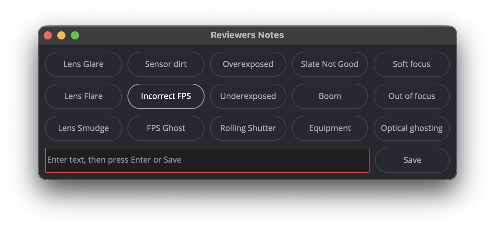

# Resolve_QCHelper

DaVinci Resolve (Workflow Integration) plugin for taking QC notes during a timeline
review. It adds a floating "Reviewers Notes" window that lets you quickly annotate the
clip under the playhead with a precise source timecode.

        

## Features

- Automatic detection of the **source timecode** (not the timeline TC) of the clip under
  the playhead, even if the clip has been trimmed/shifted on the timeline.
- 6 to 27 quick buttons, fully customizable (label + note content). The number of
  buttons follows the number of entries in `buttons_config.json` (minimum 6, maximum
  27), laid out across 3 rows — the window opens at a size that fits, and can also be
  manually resized (drag an edge/corner); the grid stretches to fill the new size.
- Keyboard shortcuts: **Ctrl+Option** (physical keys) + a key from
  **Q W E R T Y U I O P A S D F G H J K L Z X C V B N M ,** directly triggers the
  matching button (mapped 1–27 in that order), without needing to click. Every possible
  button has a shortcut this way — the 27-entry cap matches how many keys are available.
- Clicking (or pressing the shortcut for) a button number with no matching entry in
  `buttons_config.json` pops up a warning instead of saving a blank/numbered note.
- **Ctrl+W** (without Option) closes the plugin window.
- A free-text field for notes that don't fit a predefined button (submit with `Enter` or
  the `Save` button).
- Notes are appended (never overwritten) to the clip's `Reviewers Notes` metadata field
  in the Media Pool, each one prefixed with the source timecode at the moment it was
  added.
- Only one instance of the window at a time: relaunching the plugin brings the existing
  window to the front instead of opening a second one.

## Installation

1. Copy `QCHelper.py` **and** the `QCHelper_settings/` folder (with its
   `buttons_config.json`) into:

   ```
   /Library/Application Support/Blackmagic Design/DaVinci Resolve/Workflow Integration Plugins
   ```

2. Restart DaVinci Resolve if the app was already open.
3. Launch the plugin from the **Workspace > Workflow Integrations** menu (or the
   equivalent depending on your Resolve version).

> The script depends on the Fusion/`bmd` API injected by Resolve: it cannot be run
> outside the application (`python QCHelper.py` will not work).

## Usage

1. Open a project with an active timeline in Resolve.
2. Launch the plugin: the "Reviewers Notes" window appears, always on top.
3. Move the playhead onto the clip you want to comment on.
4. Either:
   - click one of the numbered buttons (or press its `Ctrl+Option+<key>` shortcut),
   - or type free text into the field and confirm with `Enter` or `Save`.
5. The note is saved in the clip's metadata, prefixed with its source timecode (e.g.
   `01:00:12:04 --> Perche`).
6. `Escape` or `Ctrl+W` closes the window.

## StreamDeck workflow

QCHelper's window doesn't have focus by default when it opens, so a single Stream Deck
key can't just replay `Ctrl+Option+<letter>` — Resolve needs to actually launch and
focus the plugin window first. A Stream Deck **Multi Action** wraps that into one press:
open the plugin, wait for it to appear, fire the note shortcut, then close the window
again. Set one Multi Action per note (one per Stream Deck key), with 4 steps:

1. **System: Hotkey** — the shortcut that opens QCHelper. This must first be assigned in
   Resolve itself: open **Keyboard Customization**, find the QCHelper Workflow
   Integration entry (under Workspace), and bind it to a free combo (e.g. `Ctrl+Option+Q`). Resolve has no default shortcut for launching a Workflow
   Integration, so this step doesn't exist until you create it.
2. **Multi Action: Delay** — gives the QCHelper window time to open and grab focus
   before the next step fires. Without this delay the following hotkey can land on
   Resolve's main window instead of QCHelper.
3. **System: Hotkey** — the actual QCHelper shortcut for the button you want to trigger:
   `Ctrl+Option+<key>`, where the key is the one mapped to that button's number (see
   [Keyboard shortcuts](#features) — `Q W E R T Y U I O P A S D F G H J K L Z X C V B N
   M ,` map to buttons 1–27 in that order).
4. **System: Hotkey** — `Ctrl+W` to close the QCHelper window again, leaving Resolve
   ready for the next note.

Since each Multi Action is tied to one specific button/key, you'll build one per Stream
Deck key you want to drive this way — up to 27, matching the shortcut row.

## Button configuration

Buttons are configured via `QCHelper_settings/buttons_config.json`:

```json
{
    "1": {"btn": "Boom", "content": "Perche"},
    "2": {"btn": "Blur", "content": "Léger flou"},
    "3": {"btn": "Bad Slate", "content": "Mauvais Clap"}
}
```

- `btn`: the text displayed on the button.
- `content`: the text inserted into the note on click (or via keyboard shortcut).

**Number of buttons.** The grid always shows `min(27, max(6, <number of entries in the
JSON>))` buttons, spread as evenly as possible across 3 rows:

| Entries in JSON | Buttons shown | Row layout |
|---|---|---|
| 0–6 | 6 | 2 / 2 / 2 |
| 10 | 10 | 4 / 3 / 3 |
| 20 | 20 | 7 / 7 / 6 |
| 27+ | 27 | 9 / 9 / 9 |

27 is the cap because that's how many keys are in the shortcut row (see Features) —
every button always has a keyboard shortcut.

The window opens at a size that fits and can be resized (see Features); if a button on
screen doesn't have a matching JSON entry (e.g. you only defined 3 entries, but the grid
still shows the 6-button minimum), clicking it — or using its keyboard shortcut — shows
a warning popup instead of saving a note.

Just edit the JSON and relaunch the plugin to apply the changes — no Python code
changes required. If the file is missing or invalid, the plugin still shows the
minimum 6-button grid as a fallback, with raw numbers (1 to 6) as labels; since none of
those buttons have a config entry, using any of them shows the missing-config warning.

> If the plugin window is already open when you edit the JSON, relaunching it just
> brings that same window back to the front — it won't reload the file or resize
> itself. Fully close the window first (`Escape` or `Ctrl+W`), then relaunch the plugin
> to see the updated buttons.

## Known limitations

- The shortcut deliberately uses **Ctrl+Option** (physical keys) rather than **Cmd**,
  because `Cmd+Shift+Q` and `Cmd+Option+Shift+Q` are reserved macOS system shortcuts
  (log out / immediate log out with Option) that intercept the keypress before it even
  reaches Resolve — this was discovered while testing a previous version.
- Debug messages (`[QCHelper][debug] ...`) are printed to Resolve's Python console on
  every keypress in the window — useful for checking the actual structure of
  `Modifiers` if a shortcut doesn't trigger. See `CLAUDE.md` for details.

## Development

See `CLAUDE.md` for details on the architecture (source TC calculation, metadata
storage, Fusion UI structure).
